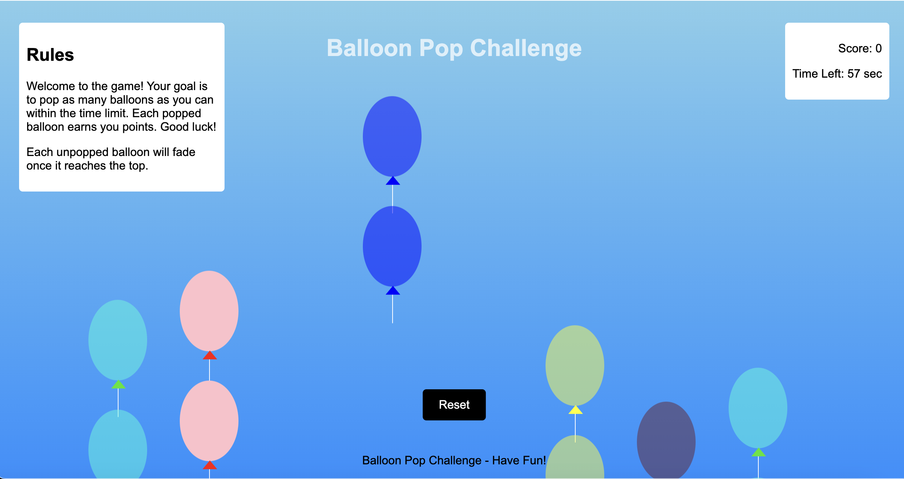

# 🎈 Balloon Popping Game

Welcome to the **Balloon Popping Game**, a fun and interactive web-based game where the goal is to pop as many balloons as possible before the timer runs out!

## 🚀 Features
- **Interactive Gameplay:** Balloons float up the screen, and you pop them by clicking on them.
- **Scoring System:** Earn points for every balloon you pop.
- **Timer:** You have 60 seconds to maximize your score.
- **Reset Option:** Replay the game as many times as you'd like.
- **Responsive Design:** Works seamlessly on both desktop and mobile devices.

## 🎮 How to Play
1. Click the **Play** button to start the game.
2. Balloons will float from the bottom of the screen upwards.
3. Pop the balloons by clicking on them.
4. Your score increases with every popped balloon.
5. The game ends when the timer runs out. Check your final score and click **Reset** to play again!

## 🛠️ Technologies Used
- **HTML5**: Structure of the game.
- **CSS3**: Styling and animations for floating balloons.
- **JavaScript**: Game logic, interactions, and dynamic elements.

## 📷 Preview

## 📝 Future Improvements
- Add different balloon types with varying points.
- Introduce difficulty levels (e.g., faster-moving balloons).
- Add sound effects for balloon pops and background music.
- Include leaderboards for players to compete.

## 📂 Repository Structure
- `index.html`: The main HTML file.
- `styles.css`: Contains all the styling for the game.
- `script.js`: JavaScript logic for the game.

## ✨ Acknowledgements
This project was created for fun and to practice web development skills. Contributions and feedback are welcome!

---

Enjoy popping balloons! 🎈✨
